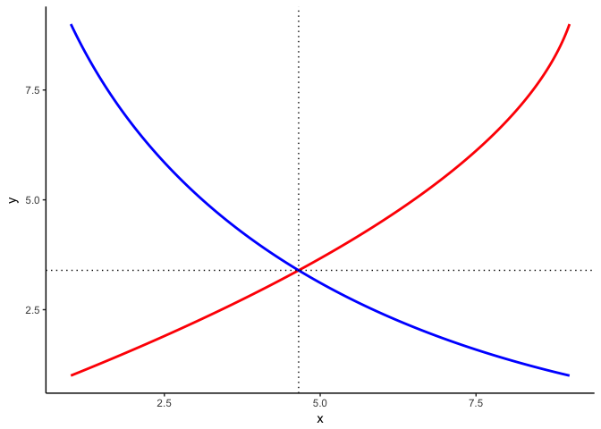

<!-- README.md is generated from README.Rmd. Please edit that file -->
reconPlots: Create economics-style plots with R
===============================================

**Author:** [Andrew Heiss](https://www.andrewheiss.com/)<br/> **License:** [MIT](https://opensource.org/licenses/MIT)

[](https://travis-ci.org/andrewheiss/reconPlots)

Intro paragraph here.

Installation
------------

This package is not on CRAN yet.

You can install the development version from Github with [devtools](https://github.com/hadley/devtools):

``` r
library(devtools)
install_github("andrewheiss/reconPlots")
```

Plotting intersections of curves
--------------------------------

The `curve_intersect()` function calculates the intersection of two curves, defined as data frames with x and y columns.

``` r
library(reconPlots)

line1 <- data.frame(x = c(1, 9), y = c(1, 9))
line1
#>   x y
#> 1 1 1
#> 2 9 9

line2 <- data.frame(x = c(9, 1), y = c(1, 9))
line2
#>   x y
#> 1 9 1
#> 2 1 9

line_intersection <- curve_intersect(line1, line2)
line_intersection
#> $x
#> [1] 5
#> 
#> $y
#> [1] 5
```

``` r
library(ggplot2)

ggplot(mapping = aes(x = x, y = y)) +
  geom_line(data = line1, color = "red", size = 1) +
  geom_line(data = line2, color = "blue", size = 1) +
  geom_vline(xintercept = line_intersection$x, linetype = "dotted") +
  geom_hline(yintercept = line_intersection$y, linetype = "dotted") +
  theme_classic()
```


This also works with curved lines created with `Hmisc:bezier()`:

``` r
curve1 <- data.frame(Hmisc::bezier(c(1, 8, 9), c(1, 5, 9)))
curve2 <- data.frame(Hmisc::bezier(c(1, 3, 9), c(9, 3, 1)))

curve_intersection <- curve_intersect(curve1, curve2)
curve_intersection
#> $x
#> [1] 4.654098
#> 
#> $y
#> [1] 3.395566

ggplot(mapping = aes(x = x, y = y)) +
  geom_line(data = curve1, color = "red", size = 1) +
  geom_line(data = curve2, color = "blue", size = 1) +
  geom_vline(xintercept = curve_intersection$x, linetype = "dotted") +
  geom_hline(yintercept = curve_intersection$y, linetype = "dotted") +
  theme_classic()
```


